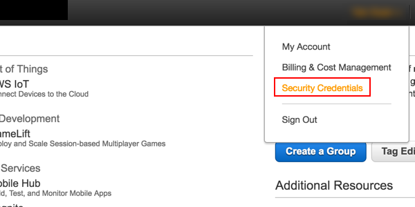
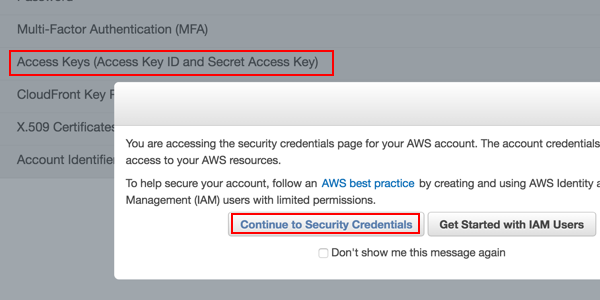
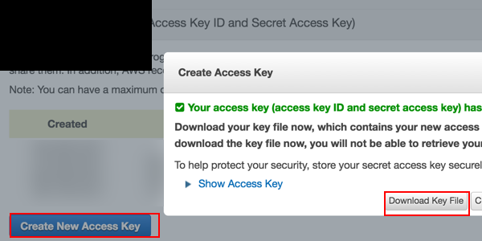

.. _cluster:

===================
Running jobs on EC2
===================

rllab comes with support for running jobs on EC2 cluster. Here are the steps to set it up:

1. Create an AWS account at `https://aws.amazon.com/ <https://aws.amazon.com/>`_. You need to supply a valid credit card (or set up consolidated billing to link your account to a shared payer account) before running experiments.
   
2. After signing up, go to the Security Credentials console, click on the "Access Keys" tab, and create a new access key. If prompted with "You are accessing the security credentials page for your AWS account. The account credentials provide unlimited access to your AWS resources," click "Continue to Security Credentials". Save the downloaded :code:`root_key.csv` file somewhere.  

    Click on the Security Credentials tab.

    Click "Continue to Security Credentials" if prompted. Then, click the Acces Keys tab.

    Click "Create New Access Key". Then download the key file.

3. Set up environment variables. On Linux / Mac OS X, edit your :code:`~/.bash_profile` and add the following environment variables:

.. code-block:: bash

    export AWS_ACCESS_KEY="(your access key)"
    export AWS_ACCESS_SECRET="(your access secret)"
    export RLLAB_S3_BUCKET="(think of a bucket name)"

For :code:`RLLAB_S3_BUCKET`, come up with a name for the S3 bucket used to store your experiment data. See `here <https://docs.aws.amazon.com/AmazonS3/latest/dev/BucketRestrictions.html>`_ for rules for bucket naming. You don't have to manually create the bucket as this will be handled by the script later. It should be of sufficient length to be unique.

4. Install the `AWS command line interface <https://aws.amazon.com/cli/>`_. Set it up using the credentials you just downloaded by running :code:`aws configure`. Alternatively, you can edit the file at :code:`~/.aws/credentials` (create the folder / file if it does not exist) and set its content to the following:

.. code-block:: bash

    [default]
    aws_access_key_id = (your access key)
    aws_secret_access_key = (your access secret)

Note that there should not be quotes around the keys / secrets!

5. Open a new terminal to make sure that the environment variables configured are in effect. Also make sure you are using the Py3 version of the environment (:code:`source activate rllab3`). Then, run the setup script:

.. code-block:: bash

    python scripts/setup_ec2_for_rllab.py

6. If the script runs fine, you've fully set up rllab for use on EC2! Try running :code:`examples/cluster_demo.py` to launch a single experiment on EC2. If it succeeds, you can then comment out the last line :code:`sys.exit()` to launch the whole set of 15 experiments, each on an individual machine running in parallel. You can sign in to the EC2 panel to `view spot instance requests status <https://us-west-1.console.aws.amazon.com/ec2sp/v1/spot/home?region=us-west-1>`_ or `running instances <https://us-west-1.console.aws.amazon.com/ec2/v2/home?region=us-west-1#Instances:sort=desc:instanceId>`_.

7. While the experiments are running (or when they are finished), use :code:`python scripts/sync_s3.py first-exp` to download stats collected by the experiments. You can then run :code:`python rllab/viskit/frontend.py data/s3/first-exp` and navigate to `http://localhost:5000 <http://localhost:5000>`_ to view the results.
